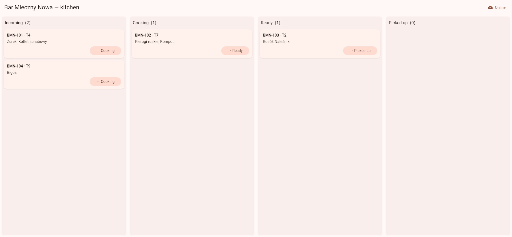
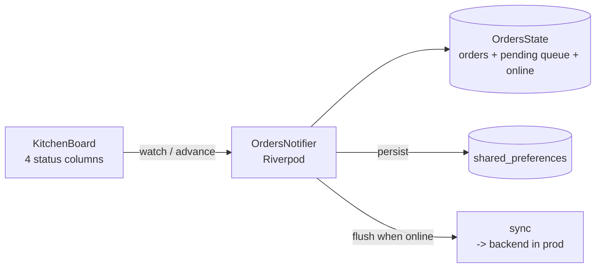

# restos-courier

A kitchen-display / courier app for the RestOS ecosystem, built with **Flutter** (web) — a live
order board where staff advance each order through its lifecycle, with an **offline-tolerant action
queue** so status changes are never lost when the connection drops. Riverpod for state,
`shared_preferences` for local persistence.


[](https://github.com/arcsymer/restos-courier/actions/workflows/ci.yml)


**▶ Live demo (GitHub Pages): <https://arcsymer.github.io/restos-courier/>**



## Quickstart

Prerequisites: **Flutter 3.44+** (Dart 3). Nothing else — no accounts, no backend to run.

```sh
git clone https://github.com/arcsymer/restos-courier && cd restos-courier
flutter pub get
flutter run -d chrome        # or: flutter run -d web-server --web-port 8080
```

Tests and analysis:

```sh
flutter analyze
flutter test
```

## Architecture



Advancing an order (`Incoming -> Cooking -> Ready -> Picked up`) updates the board **and** enqueues a
`PendingAction`. If the app is offline the action stays queued and persisted; when it comes back
online the queue flushes. State and queue survive a page reload.

## Features

1. **Kitchen display** — a live board with a column per status; cards show order, table, and items.
2. **Status transitions** — one tap advances an order to the next stage (forward-only).
3. **Riverpod state** — a `Notifier` holds orders, the pending queue, and the online flag.
4. **Offline-tolerant action queue** — changes are queued + persisted while offline and flushed on
   reconnect; a header chip shows how many are queued.
5. **Local persistence** — orders and the queue are stored in `shared_preferences` (survive reload).
6. **Web build + Pages deploy** — the release web build ships to GitHub Pages via Actions.
7. **Widget tests + CI** — `flutter analyze` + widget tests (render, offline-queue, online-flush)
   run in CI, which also builds the web release.

## Limitations

- **Sync is simulated.** There is no live backend on the static Pages demo, so "flush to backend"
  just clears the queue — the queue/persistence/offline behaviour is real, the network call is the
  stub. Wiring it to the [restos-portal](https://github.com/arcsymer/restos-portal) API is a v2 idea.
- **Web only.** An Android APK would need the Android toolchain, which isn't set up here (v2).
- Orders are synthetic seed data for one fictional milk bar; no real kitchen or PII.
- Online/offline is a manual toggle (demo), not real connectivity detection.

## v2 ideas

Wire the queue to a real orders API; `connectivity_plus` for true online/offline; conflict handling
on sync; an Android/iOS build; drift for a richer local DB.

## License & attribution

MIT — see [LICENSE](LICENSE). Part of the [RestOS](https://github.com/arcsymer) portfolio.

Built end-to-end with an agentic workflow (Claude Code), orchestrated, reviewed, and directed by me.
